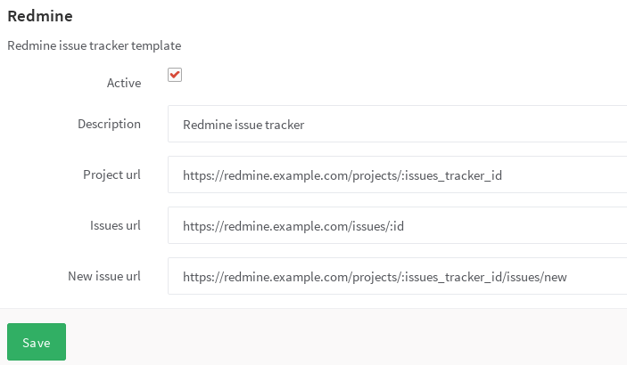

# Service templates

Using a service template, GitLab administrators can provide default values for configuring integrations at the project level.

When you enable a service template, the defaults are applied to **all** projects that do not
already have the integration enabled or do not otherwise have custom values saved.
The values are pre-filled on each project's configuration page for the applicable integration.

If you disable the template, these values no longer appear as defaults, while
any values already saved for an integration remain unchanged.

## Enable a service template

Navigate to the **Admin Area > Service Templates** and choose the service
template you wish to create.

## Service for external issue trackers

The following image shows an example service template for Redmine.

For each project, you will still need to configure the issue tracking
URLs by replacing `:issues_tracker_id` in the above screenshot with the ID used
by your external issue tracker.
